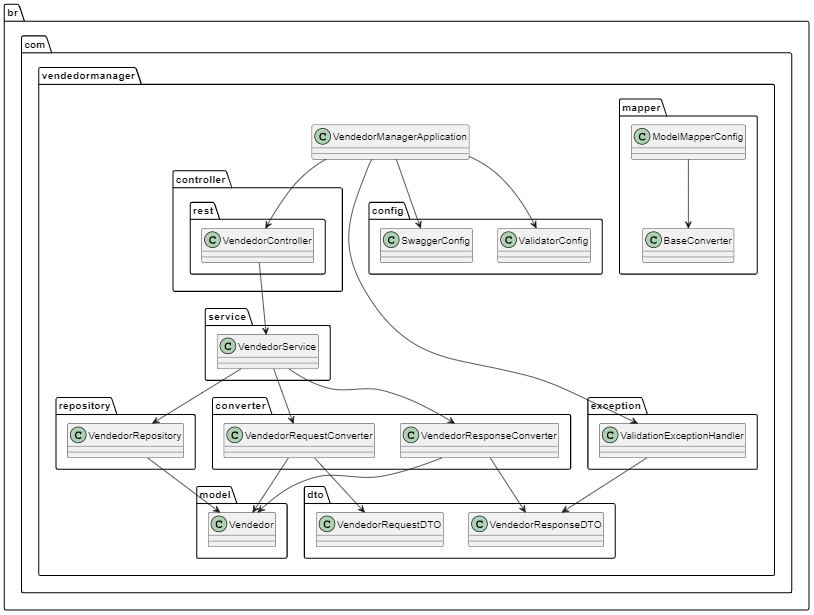

# Vendedor Manager Application
Este projeto é uma aplicação de gerenciamento de vendedores, construída utilizando Spring Boot. A aplicação fornece uma API REST para criar, ler, atualizar e deletar vendedores, além de uma interface de documentação interativa usando Swagger.

## Requisitos
- Java 11 ou superior
- Maven
- Como rodar a aplicação

### 1. Clonar o repositório
```bash
   git clone https://github.com/seu-usuario/vendedor-manager.git
   cd vendedor-manager
```   
   
### 2. Compilar e rodar a aplicação

```bash
   mvn clean install
   mvn spring-boot:run
```   
   A aplicação estará rodando em http://localhost:8080.

## Documentação da API
A documentação interativa da API está disponível no Swagger. Para acessar a documentação:

Inicie a aplicação.
Acesse http://localhost:8080/swagger-ui/index.html no seu navegador.

## Estrutura da aplicação

```bash
src/
├── main/
│   ├── java/
│   │   └── br/
│   │       └── com/
│   │           └── vendedormanager/
│   │               ├── VendedorManagerApplication.java
│   │               ├── config/
│   │               ├── controller/
│   │               ├── converter/
│   │               ├── dto/
│   │               ├── exception/
│   │               ├── mapper/
│   │               ├── model/
│   │               ├── repository/
│   │               └── service/
│   └── resources/
│       ├── application.properties
│       └── static/
├── test/
│   └── java/
│       └── br/
│           └── com/
│               └── vendedormanager/
│                   └── VendedorManagerApplicationTests.java
└── pom.xml
```

### Diagrama de componentes



## O que a Aplicação Faz

Esta aplicação gerencia informações de vendedores. As principais operações disponíveis são:

- **Criar Vendedor**: Endpoint POST para criar um novo vendedor.
- **Obter Vendedor por ID**: Endpoint GET para obter informações de um vendedor específico.
- **Atualizar Vendedor**: Endpoint PUT para atualizar informações de um vendedor existente.
- **Deletar Vendedor**: Endpoint DELETE para remover um vendedor pelo seu ID.

Cada operação é validada utilizando Swagger e Bean Validation para garantir a integridade dos dados.

---

## Exemplos de Curl para os Endpoints:

### Criar Vendedor:

```bash
curl -X POST "http://localhost:8080/vendedores" -H "Content-Type: application/json" -d '{
    "matricula": "98767367-OUT",
    "nome": "João Silva",
    "dataNascimento": "1980-01-01",
    "documento": "12345678901",
    "email": "joao.silva@example.com",
    "tipoContratacao": "Outsourcing",
    "filialId": 1
}'
```

### Obter Vendedor por ID:

```bash
curl -X GET "http://localhost:8080/vendedores/{id}"
```

#### Substitua {id} pelo ID do vendedor desejado.

### Atualizar Vendedor por ID:

```bash
curl -X PUT "http://localhost:8080/vendedores/{id}" -H "Content-Type: application/json" -d '{
"matricula": "98767367-OUT",
"nome": "João Silva",
"dataNascimento": "1980-01-01",
"documento": "12345678901",
"email": "joao.silva@example.com",
"tipoContratacao": "Outsourcing",
"filialId": 1
}'
```

### Deletar Vendedor por ID:

```bash
curl -X DELETE "http://localhost:8080/vendedores/{id}"
```


## Padrões de Design Utilizados no Projeto

### MVC (Model-View-Controller)

O padrão MVC é utilizado para organizar a estrutura da aplicação em três componentes principais:

- **Model**: Representado pelas classes de modelo como `Vendedor`, `VendedorRequestDTO` e `VendedorResponseDTO`. O Model encapsula os dados e regras de negócio da aplicação.

- **View**: No contexto da aplicação RESTful, a "View" é representada indiretamente pela estrutura das respostas JSON retornadas pelos endpoints.

- **Controller**: Representado pela classe `VendedorController`, responsável por receber requisições HTTP, delegar o processamento para o serviço (`Service`) adequado e retornar as respostas apropriadas.

### DTO (Data Transfer Object)

Os DTOs são utilizados para transferência de dados entre camadas da aplicação e para representação dos dados recebidos ou enviados pela API. Exemplos incluem `VendedorRequestDTO` e `VendedorResponseDTO`, que ajudam a separar a representação interna dos dados (`Model`) da interface externa/API (`Controller`).

### Repository Pattern

O padrão Repository é implementado na camada de acesso a dados (`Repository`), como `VendedorRepository`. Ele abstrai e encapsula o acesso aos dados, proporcionando métodos para operações de persistência sem expor detalhes de implementação específicos.

### Dependency Injection (DI)

O Spring Framework utiliza extensivamente o princípio de Injeção de Dependência para gerenciar as dependências entre os componentes da aplicação. Isso é evidente nas anotações `@Autowired` nos serviços (`Service`) e conversores (`Converter`), como `VendedorService`.

### Strategy Pattern (ModelMapper)

Embora não seja explicitamente implementado como tal, o uso do ModelMapper dentro da interface `BaseConverter` pode ser considerado uma implementação simplificada do padrão Strategy. O ModelMapper é configurado globalmente e utilizado para converter entre entidades e DTOs de forma padronizada.

### Builder Pattern (SwaggerConfig)

A configuração do Swagger (`SwaggerConfig`) pode ser vista como uma implementação do padrão Builder. As classes `OpenAPI` e `GroupedOpenApi` são construídas de forma fluente e configuradas com várias opções usando métodos encadeados (`builder pattern`).

---

Esses padrões de design ajudam a estruturar o projeto de forma organizada e modular, promovendo a reutilização de código, manutenção facilitada e uma separação clara de responsabilidades entre os componentes da aplicação.


